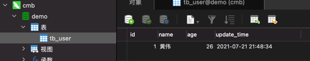

# code-generator-manager 【代码生成器后端代码】

## 基于 spring-boot 开发

## spring-boot 链接数据库使用 MyBatis

- [SpringBoot整合mybatis快速入门](https://www.jianshu.com/p/541874714907)

##### 使用示例：
1. 在自己数据库里面建 tb_user表 , SQL 文件（tb_user.sql）在项目目录下，直接导入自己的数据库工具中即可。
    
2. 在 application.yaml 中修改代码
    ```yaml
    spring:
      datasource:
        username: [自己的账户名]
        password: [自己的数据库密码]
        url: jdbc:mysql://localhost:3306/[自己的数据库库名]?characterEncoding=utf-8&serverTimezone=GMT%2B8
    ```
